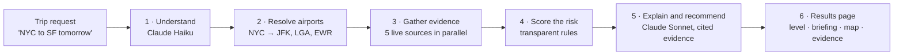

# Travel Disruption Radar

A working prototype that tells a traveler, or an Operations team, whether a U.S. trip is likely to be disrupted. It shows what the risks are, the evidence behind them, and what action to take, if any.

Enter a route and a date, for example **"New York to San Francisco tomorrow"**. The app then:

1. pulls **live data from five public aviation and weather sources**;
2. scores the risk with **transparent, testable rules**;
3. uses **Claude (Anthropic)** to write a short briefing in which every risk and recommended action cites its evidence.

## Contents

- [What it does](#what-it-does)
- [How it works](#how-it-works)
- [Data sources](#data-sources)
- [Where AI is used](#where-ai-is-used)
- [How risk and uncertainty are assessed](#how-risk-and-uncertainty-are-assessed)
- [Running it](#running-it)
- [Project structure](#project-structure)
- [Assumptions and limitations](#assumptions-and-limitations)

---

## What it does

| The question | How the app answers it |
|---|---|
| Are there meaningful risks to this trip? | A headline level (**LOW**, **MODERATE**, **HIGH** or **UNKNOWN**) with a confidence level and the reasons behind it |
| What are the risks? | A briefing listing the key risks, a breakdown by **departure, en route and arrival**, and a check of nearby alternate airports (e.g. "NYC" also checks LGA and EWR) |
| What is the evidence? | An evidence table. Every finding has an ID (`E1`, `E2`…), a link to its source, an issue time, a note on why it does or doesn't apply to the trip date, and the raw source text |
| What should I do? | Recommended actions, each tagged with **when** to act (now, the day before, the day of travel, or if things change) and the evidence it is based on |

The results also include:
- a **map** of the flight path, showing any active hazard areas that cross it;
- a **"Sources checked"** panel with each source's status, response time and forecast range, so missing data is never hidden.

## How it works



1. **Understand the trip.** Claude Haiku turns free text into an origin, a destination and a date, and lists any assumptions it made. If AI is unavailable, a regex parser does this instead.
2. **Resolve airports.** The app matches the request against 502 U.S. airports with scheduled airline service. It accepts:
   - airport codes;
   - city names;
   - metro areas (NYC → JFK, LGA, EWR);
   - small towns, which it geocodes and maps to the nearest airline airports.
3. **Gather live evidence.** Five source adapters run in parallel, each with its own timeout. Each one turns its raw data into the same evidence record, which carries:
   - a severity;
   - a confidence;
   - a plain-English note on whether it applies to the trip date.
4. **Score the risk.** Fixed rules set the level, the confidence and the per-segment breakdown. **The rules, not the AI, decide the headline level**, so it is reproducible and testable.
5. **Explain and recommend.** Claude Sonnet receives only the evidence records and writes the briefing. Every risk and action must cite evidence IDs, and the server checks those citations before showing anything.
6. **Show the results** in the browser.

The data usually arrives within 1–2 seconds. Writing the AI briefing adds roughly 10–20 seconds.

## Data sources

All five are free and public, and all data is fetched live; nothing is mocked.

| Source | What it provides | Time range | Why it's used |
|---|---|---|---|
| [FAA NAS Status](https://nasstatus.faa.gov/) | Ground stops, ground delay programs, arrival and departure delays, closures | Right now | The most direct, authoritative sign that an airport is impaired |
| [National Weather Service](https://www.weather.gov/documentation/services-web-api) | Active and upcoming alerts at each airport, plus the local forecast | Alerts as issued; forecast about 7 days | The official U.S. weather-warning source |
| [AviationWeather.gov TAFs](https://aviationweather.gov/data/api/) | Airport aviation forecasts: cloud ceilings, visibility, wind, thunderstorms, freezing precipitation | About 24–30 hours | The forecasts airline dispatchers plan against |
| [Open-Meteo](https://open-meteo.com/) | Daily model forecast: weather type, snow, gusts, rainfall and its probability | Up to 16 days | The only free source that reaches beyond one week |
| [AviationWeather.gov SIGMETs](https://aviationweather.gov/data/api/) | Areas of thunderstorms, turbulence, icing or volcanic ash, checked against the flight path | A few hours | Covers risk along the route, not just at the airports |

Supporting data:
- [OurAirports](https://ourairports.com/data/): airport reference data, bundled in `data/airports.json`.
- Open-Meteo geocoding: looks up small towns.
- [OpenStreetMap](https://www.openstreetmap.org/): map tiles.

## Where AI is used

| Task | Model | Safeguards |
|---|---|---|
| Understanding free-text trip requests, such as "Chicago to Denver next Friday" or "big apple to frisco tomorrow" | `claude-haiku-4-5` | A strict JSON schema; the date is validated; a regex parser takes over on any error |
| Writing the briefing: headline, summary, key risks, actions, uncertainty, what to watch for, and Claude's own view of the risk level | `claude-sonnet-5` | See below |

Safeguards on the briefing:

- **Claude sees only the evidence records.** It can't browse the web or read raw source data.
- **A strict schema** fixes the shape of the response and requires every field.
- **Every risk and action must cite evidence IDs.** The server removes citations to IDs that don't exist and drops any risk left without support. The page shows how many were removed.
- **Incomplete briefings are retried once.** Any gap left after that is filled from the rules and labelled as such.
- **The rule-based level always wins.** Claude's own level is shown as a "second opinion" only when it disagrees.
- **The app still works without AI.** Any AI error, or a missing API key, switches to a rule-based briefing, and the page header says so.

AI is **not** used to fetch data, to decide whether evidence applies to the trip date, to set severity thresholds, to choose the risk level, or to set confidence. These need to be predictable, testable and explainable. Only airports, dates and public data are sent to Claude, never personal information.

## How risk and uncertainty are assessed

- **Severity.** Each piece of evidence is scored from 0 (none) to 3 (high) using rules specific to its source. For example, an FAA ground delay program averaging an hour or more is high, and forecast wind gusts of 35 knots or more are moderate. The rules live in [`app/sources/`](app/sources/).
- **Relevance to the trip date.** Evidence is judged against the travel day, not just against "now":
  - A weather-driven FAA delay today is shown as *context only* for a trip two days away.
  - A delay caused by runway construction tends to last, so it is carried forward at lower confidence.
  - FAA "closures" that only apply to private aircraft are shown but not counted.
- **Level.** The trip takes the highest level found at departure, en route or arrival.
- **No data is not low risk.** If no forecast covers the trip date and nothing else points to a problem, the level is **UNKNOWN**, not LOW.
- **Confidence** depends on how far away the trip is:

  | Trip date | Confidence |
  |---|---|
  | Today or tomorrow | High |
  | 2–4 days away | Medium |
  | 5–15 days away | Low |
  | 16 or more days away | Very low |

  Confidence drops one step for each source that fails. Each piece of evidence also has its own confidence. For example, conditions a TAF forecasts as only temporary count for less.
- **Corroboration.** An airport is marked "corroborated" when two independent sources flag it as moderate or worse.
- **Failures are isolated.** Each source runs on its own with a timeout. A source that fails shows as an error and lowers confidence; it never breaks the assessment.

The scoring logic is in [`app/risk.py`](app/risk.py), and the whole pipeline is covered by unit tests.

---

## Running it

### Requirements

- **Python 3.10 or newer.** Check with `python3 --version`. Tested on macOS with Python 3.10.
- **An internet connection.** All data is fetched live.
- **macOS or Linux** to use the one-command launcher. On Windows, use the manual steps below.
- **Optional: an Anthropic API key**, from [console.anthropic.com](https://console.anthropic.com/settings/keys). Without one the app still works end to end, using its rule-based parser and briefing.

### Quick start (macOS / Linux)

```bash
git clone https://github.com/JayPacker477/Assignment_Juwon_Packer.git
cd Assignment_Juwon_Packer
./scripts/start.sh
```

The first run takes about a minute. It creates a virtual environment in `.venv`, installs the dependencies, and creates a `.env` settings file from `.env.example`. It then starts the app at **http://127.0.0.1:8000** and opens it in your browser. Press **Ctrl+C** to stop.

### Enabling AI

1. Open `.env` in the project folder.
2. Paste your key after `ANTHROPIC_API_KEY=` and save:
   ```
   ANTHROPIC_API_KEY=sk-ant-...
   ```
3. Stop the app (Ctrl+C) and run `./scripts/start.sh` again.

The badge in the top-right corner reads **"AI: Claude (…)"** when AI is on, and **"AI off · rule-based fallback"** when it isn't. `.env` is git-ignored, so the key never ends up in the repository.

### Launcher options

| Command | What it does |
|---|---|
| `./scripts/start.sh` | Start the app on port 8000 |
| `./scripts/start.sh --port 9000` | Use a different port |
| `./scripts/start.sh --no-ai` | Start a second copy with AI turned off, on port 8001, to compare with the AI version |
| `./scripts/start.sh --no-browser` | Don't open a browser tab |

### Manual setup (any operating system)

macOS / Linux:

```bash
python3 -m venv .venv
.venv/bin/pip install -r requirements.txt
cp .env.example .env
.venv/bin/uvicorn app.main:app --port 8000
```

Windows (PowerShell):

```powershell
python -m venv .venv
.venv\Scripts\pip install -r requirements.txt
copy .env.example .env
.venv\Scripts\uvicorn app.main:app --port 8000
```

Then open http://127.0.0.1:8000.

### Using the app

Type a trip in plain English and press Enter. For example:

- `New York to San Francisco tomorrow`
- `Boston to Las Vegas today`
- `Chicago to Denver next Friday`
- `Seattle to Miami in 30 days` (beyond every forecast, so the answer is UNKNOWN)

You can also fill in **From**, **To** and **Date** and click **Assess trip**. Both place fields accept city names or airport codes, such as `NYC` or `JFK`.

In the briefing, click a citation such as `E1` to jump to that evidence. To see the original source text, open **"raw source data"** on any evidence row.

### Running the tests

```bash
.venv/bin/python -m pytest -q
```

On Windows, run `.venv\Scripts\python -m pytest -q`. The unit tests need no network access and finish in under a second. They cover:
- the scoring rules for every source;
- turning place names into airports;
- the fallback date parser;
- citation checking, including made-up citation IDs;
- the AI retry logic, using a fake model so no API calls are made.

### Optional: pre-flight check

```bash
.venv/bin/python scripts/preflight.py
```

This checks the API key and every data source. It then scans about 30 major U.S. airports with the app's own rules and suggests trips that will show live disruptions right now. Add `--days 1` to scan for tomorrow's trips instead.

### Configuration

All settings are optional and live in `.env`:

| Variable | Default | Purpose |
|---|---|---|
| `ANTHROPIC_API_KEY` | empty | Turns on AI. When empty, the app uses its rule-based fallback |
| `ANTHROPIC_MODEL` | `claude-sonnet-5` | The model that writes the briefing |
| `ANTHROPIC_PARSE_MODEL` | `claude-haiku-4-5` | The model that reads free-text trip requests |
| `HTTP_USER_AGENT` | built-in | Identifies the app to api.weather.gov, which requires a User-Agent with contact details |
| `HTTP_TIMEOUT_S` | `12` | Timeout for each external request, in seconds |
| `CACHE_TTL_S` | `300` | Default time, in seconds, that fetched data is reused |

### Troubleshooting

| Problem | Fix |
|---|---|
| `permission denied: ./scripts/start.sh` | Run `bash scripts/start.sh` instead, or run `chmod +x scripts/start.sh` first |
| "Port 8000 is already in use" | The app may already be running: open http://127.0.0.1:8000, or start on another port with `--port 8002` |
| The badge says "AI off · rule-based fallback" | Add `ANTHROPIC_API_KEY` to `.env`, then restart the app |
| A source shows "error" under *Sources checked* | That public API is temporarily unavailable. The assessment still completes, with lower confidence |
| "Couldn't find a U.S. airport for …" | Use a U.S. city name or an airport code such as `JFK` |

---

## Project structure

```
app/                      Backend (Python, FastAPI)
  main.py                 API routes and the web page
  service.py              The pipeline: resolve airports → gather evidence in parallel → score → brief
  airports.py             Turns city names, metro areas and airport codes into airports
  sources/                One adapter per data source (faa, nws, taf, open_meteo, sigmet)
  risk.py                 Rule-based scoring: level, confidence, route segments
  ai.py                   Claude trip parsing and briefing, with validation and fallbacks
  models.py               The shared evidence record and other data shapes
  http.py                 Shared HTTP client with a small in-memory cache
static/                   Web page (HTML, CSS, JavaScript, Leaflet map)
scripts/
  start.sh                One-command launcher
  preflight.py            Dependency check and live route suggestions
  build_airports.py       Rebuilds data/airports.json from OurAirports
data/airports.json        502 U.S. airports with scheduled airline service
docs/architecture.drawio  Architecture diagrams
tests/                    Unit tests, including a saved real FAA response
```

**API endpoints** (interactive docs at http://127.0.0.1:8000/docs while the app is running):

| Endpoint | Purpose |
|---|---|
| `POST /api/parse` | Free text → origin, destination, date and assumptions |
| `POST /api/assess` | Origin, destination and date → the full assessment, evidence and briefing |
| `GET /api/airports?q=` | Airport autocomplete |
| `GET /api/health` | Server status, and whether AI is enabled |

**Architecture diagrams.** [`docs/architecture.drawio`](docs/architecture.drawio) has two pages:
- the high-level flow, including which sources apply at which lead times;
- the technical architecture.

Open it at [app.diagrams.net](https://app.diagrams.net) (**File → Open from → Device**), or in VS Code with the *Draw.io Integration* extension.

## Assumptions and limitations

- **It assesses the route, not a specific flight.** No free source offers flight-level status, so the app doesn't know flight numbers, departure times or connections. It assesses the whole travel day, from midnight at the origin to the end of the day at the destination, and assumes a direct flight.
- **Severity thresholds are hand-tuned** from aviation-operations knowledge. They have not yet been checked against historical delay and cancellation data.
- **Dates.** Relative dates typed as text ("today", "tomorrow") are read in U.S. Eastern time. The trip date itself is judged in the origin airport's local time.
- **Airport codes.** FAA airport identifiers are assumed to match airline (IATA) codes. This holds for major airports but not for every small airfield.
- **Live data needs an internet connection.** Responses are cached in memory for 2–15 minutes, depending on the source, to limit load on the free public APIs.
- **Credentials.** None are stored in this repository. The Anthropic API key is read from a local `.env` file, which is git-ignored; `.env.example` is an empty template.
